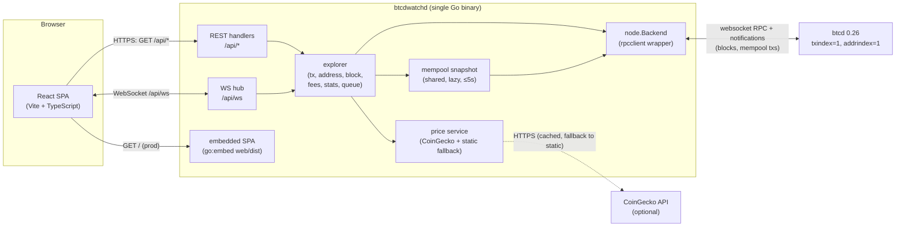
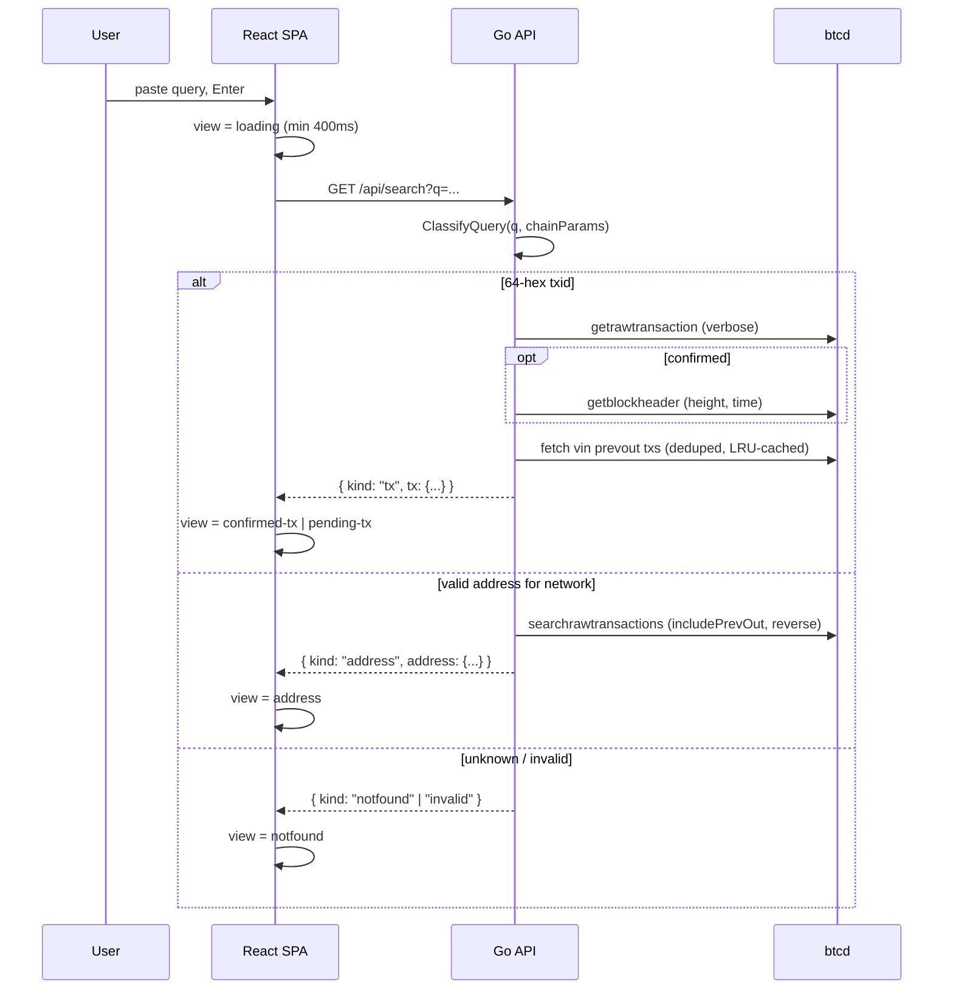
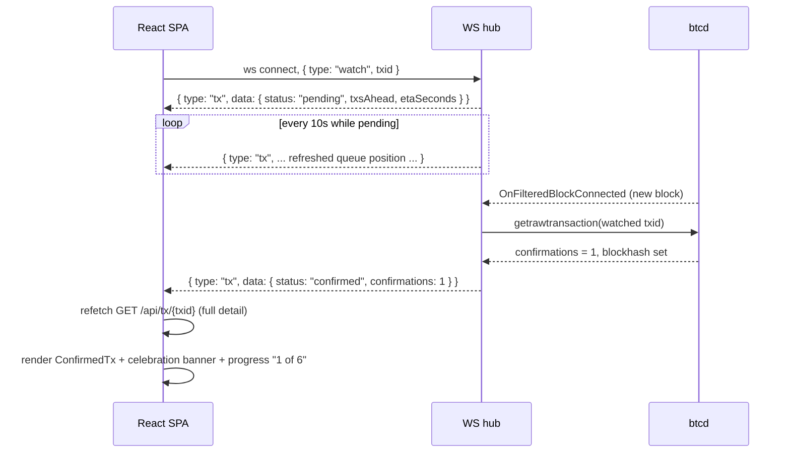

# btcd.watch — System Architecture

btcd.watch is a beginner-friendly Bitcoin transaction and address explorer that answers one
question well: **"is my Bitcoin confirmed?"** It is backed by a locally operated
[btcd](https://github.com/btcsuite/btcd) full node rather than a third-party API.

This document is the authoritative technical design.

---

## 1. Overview & goals

**Audience.** People who just sent or received Bitcoin and want a plain-language answer about its
status — not a power-user chain-analysis tool. The UI leads with status, plain-English
explanations, and a live "watch this transaction" mode; raw detail is available behind a
Simple/Detailed toggle.

**Product goals**

- Paste a transaction ID or address → get an instant, understandable answer
  (pending / confirmed / not found), with fees, amounts, and sender/receiver shown in both BTC and USD.
- **Live updates**: a watched pending transaction flips to "Confirmed 🎉" the moment a block
  includes it, with no page refresh.
- Landing page doubles as a network dashboard: block height, mempool size, next-block ETA,
  halving countdown, BTC price, and a three-tier fee estimator.
- Runs entirely against the operator's own btcd node. **Regtest by default**, with mainnet /
  testnet / signet / simnet selectable purely through configuration — no hardcoded network
  constants anywhere.

**Non-goals (v1)**: wallet functionality, xpub tracking, chain analytics, multi-node support,
block-browsing UI, authentication.

**Stack**: Go backend using btcd's own `rpcclient` (websocket mode) exposing REST + WebSocket;
React + Vite + TypeScript SPA; production deploys as a single Go binary with the built SPA
embedded.

---

## 2. System context & component diagram



Key structural points:

- **One node dependency.** Everything chain-related flows through the `node.Backend` interface,
  a thin wrapper over btcd's `rpcclient` in **websocket mode**. Websocket mode is required
  because btcdwatch relies on btcd's push notifications (new blocks, mempool acceptance) — plain
  HTTP POST mode has no notification channel.
- **One shared mempool snapshot.** Fee percentiles, pending-transaction queue position, and the
  "pending" example chip all read the same lazily-refreshed snapshot of
  `getrawmempool verbose=true`, so the node is never hammered with redundant full-mempool calls.
- **Price is best-effort.** A CoinGecko fetcher with an in-memory cache; on any failure (or when
  configured for offline/regtest use) a static configured price is served and labeled as such.

### Deployment topologies

| Mode | Topology |
| --- | --- |
| **Development** | Two processes: `btcdwatchd` serving the API on `127.0.0.1:8480`, and Vite dev server on `:5174` proxying `/api` (including WebSocket upgrade) to the Go server. Hot reload on both sides. |
| **Production** | One binary. `make build` runs `npm run build` then `go build`; the Vite `dist/` output is embedded via `go:embed` and served with an SPA fallback (any non-`/api/*` path returns `index.html`). A `--static-dir` flag can override the embedded assets for on-disk serving. |

---

## 3. Backend package responsibilities

```
cmd/btcdwatchd/            main: load config, construct node client, explorer services,
                           HTTP server; graceful shutdown.
internal/config/           YAML config file + BTCDWATCH_* environment overrides. Validation.
internal/chain/            Network abstraction: maps a network name to chaincfg.Params;
                           halving math from params.SubsidyReductionInterval;
                           ClassifyQuery() (txid vs address vs invalid) + ParseBlockHeight();
                           BlockSubsidy() for coinbase-derived block fee totals.
internal/node/             node.Backend interface + the rpcclient websocket implementation.
                           Owns notification registration, reconnect handling, and the
                           degraded-mode behavior when btcd is unreachable.
internal/explorer/         All data derivation, one file per concern:
                           tx.go, address.go, block.go, mempool.go, fees.go, stats.go, queue.go
                           (+ *_test.go). Pure logic against node.Backend — fully unit-testable
                           with mocked backends and btcjson fixtures.
internal/price/            BTC/USD price: CoinGecko fetch, refresh loop, cache,
                           static fallback.
internal/api/              HTTP layer: server.go (routing/middleware), handlers.go (REST),
                           ws.go (per-connection read/write pumps), hub.go (fan-out event
                           loop), static.go (embedded SPA + fallback).
web/                       Vite + React + TypeScript SPA; web/embed.go exposes the built
                           dist/ to the Go binary.
```

Design rule: `internal/explorer` never imports `rpcclient` directly — only `node.Backend`. Every
derivation (fees, from/to, percentiles, address totals) is testable without a running node.

### `node.Backend` interface (mockable)

The interface exposes exactly the RPCs the explorer needs, in btcjson result types:

```go
type Backend interface {
    GetRawTransactionVerbose(txid *chainhash.Hash) (*btcjson.TxRawResult, error)
    GetBlockHeaderVerbose(hash *chainhash.Hash) (*btcjson.GetBlockHeaderVerboseResult, error)
    GetBlockHash(height int64) (*chainhash.Hash, error)
    GetBlockCount() (int64, error)
    GetBlockVerbose(hash *chainhash.Hash) (*btcjson.GetBlockVerboseResult, error)
    GetRawMempoolVerbose() (map[string]btcjson.GetRawMempoolVerboseResult, error)
    GetMempoolInfo() (*btcjson.GetMempoolInfoResult, error)
    SearchRawTransactionsVerbose(addr btcutil.Address, skip, count int,
        includePrevOut, reverse bool, filterAddrs []string) ([]*btcjson.SearchRawTransactionsResult, error)
}
```

(Exact signatures may be adjusted during implementation; the principle — a narrow, mockable
seam over `rpcclient` — is the architectural commitment.)

---

## 4. REST API contract

All endpoints live under `/api`. Conventions:

- **Amounts are satoshis as JSON integers (`int64`)** — never floating-point BTC. The frontend
  formats BTC/sat display.
- **Fiat values are computed server-side** (`fiatUsd`, float, 2-decimal semantics) using the
  price service, so the UI never needs its own price source.
- Errors: non-2xx with `{"error": {"code": "<machine_code>", "message": "<human text>"}}`.
  `503` with code `node_unavailable` when btcd is unreachable.
- All responses `Content-Type: application/json`; timestamps are Unix seconds (`int64`).

### `GET /api/search?q=<query>`

The **backend** classifies the query; the frontend never guesses (the design prototype's regexes
were mainnet-only and are deliberately not reproduced client-side).

Classification (`internal/chain.ClassifyQuery` + `ParseBlockHeight`), block rules first:

1. All digits (thousands-separator commas allowed, ≤10 digits) → block height lookup.
2. Trimmed 64-char hex string → txid **or block hash**: the leading-zeros form
   (`00000000…`, i.e. a mined mainnet-style hash) tries the block lookup first with txid as
   fallback; anything else tries txid first and falls back to a block-hash lookup before
   reporting not-found (regtest hashes rarely show leading zeros).
3. Otherwise `btcutil.DecodeAddress(q, activeParams)` succeeds → address (this validates the
   bech32 HRP / base58 version against the **configured** network, so a mainnet `bc1…` address is
   correctly rejected on regtest, whose HRP is `bcrt`).
4. Otherwise → invalid.

Response envelope:

```json
{ "kind": "tx",       "tx": { ...same shape as /api/tx/{txid}... } }
{ "kind": "address",  "address": { ...same shape as /api/address/{addr}... } }
{ "kind": "block",    "block": { ...same shape as /api/block/{ref}... } }
{ "kind": "notfound", "query": "..." }   // well-formed, but unknown to the node
{ "kind": "invalid",  "query": "..." }   // not a height, txid, or valid address for this network
```

### `GET /api/tx/{txid}`

```json
{
  "txid": "hex",
  "status": "pending" | "confirmed",
  "amountSats": 123456789,
  "fiatUsd": 1234.56,
  "from": ["bcrt1q..."],
  "to":   ["bcrt1q..."],
  "isCoinbase": false,
  "inputs":  [ { "address": "bcrt1q...", "amountSats": 6000000, "change": false } ],
  "outputs": [ { "address": "bcrt1q...", "amountSats": 4250000, "change": false },
               { "address": "bcrt1q...", "amountSats": 1748740, "change": true  } ],
  "confirmations": 3,
  "block": { "height": 512, "hash": "hex", "time": 1735000000 },   // null while pending
  "feeSats": 141,                        // null for coinbase ("newly minted")
  "feeRateSatPerVb": 1.0,                // null for coinbase
  "vsize": 141,
  "firstSeen": 1735000000,               // mempool entry time while pending; block time once confirmed
  "type": { "code": "P2WPKH", "in": "P2WPKH", "out": "P2TR" },  // null when non-standard; in empty for coinbase
  "rbf": true,                           // BIP-125 replaceability signaled (any input sequence < 0xfffffffe)
  "pending": {                           // null once confirmed
    "txsAhead": 12,
    "vbytesAhead": 34567,
    "etaBlocks": 1,
    "etaSeconds": 600,
    "queueVbytesFraction": 0.58      // share of mempool vbytes paying more — "you are here" on the queue bar
  }
}
```

Derivation details are in [§6](#6-data-derivation-logic). Notable RPC constraint: btcd's
`getrawtransaction` verbose result includes `blockhash` and `confirmations` but **no block
height** — height and block time come from a follow-up `getblockheader` (cached per hash).

### `GET /api/address/{addr}?offset=0&limit=25`

```json
{
  "address": "bcrt1q...",
  "type": "P2WPKH",            // script-type code from the decoded address; "" hides the type UI
  "balanceSats": 5000000000,
  "receivedSats": 7500000000,
  "sentSats": 2500000000,
  "fiatUsd": 4900000.00,
  "txCount": 42,
  "approximate": false,        // true when history exceeded address.max_scan_txs
  "activity": [
    {
      "txid": "hex",
      "direction": "received" | "sent" | "self",
      "amountSats": 2500000000,          // net effect on this address (always positive; direction carries sign)
      "status": "pending" | "confirmed",
      "confirmations": 6,
      "time": 1735000000                 // block time, or first-seen for mempool entries
    }
  ],
  "offset": 0,
  "limit": 25,
  "hasMore": true
}
```

Backed by btcd's `searchrawtransactions` (requires `addrindex=1`), which returns confirmed *and*
mempool history and — with `includePrevOut=true` — inlines each input's previous output
addresses and values, so direction/net-amount computation needs **no additional RPC calls per
transaction**.

### `GET /api/stats`

Stats, fees, and the WS mempool update are **cache-served**: one background single-flight
refresh (every 5s while read, with the same 2-minute wedged-refresh watchdog as the sync check)
recomputes all three, and requests always get the last computed values instantly. btcd blocks
the RPCs these feeds need (`getrawmempoolverbose` reads the UTXO cache, header lookups take the
chain lock) for minutes while flushing its UTXO cache — computing on the request path hung
`/api/stats` past Cloudflare's 100s origin timeout. A refresh that fails keeps the previous
values; `503 node_unavailable` only before the first-ever compute (warmed on node connect).

```json
{
  "blockHeight": 512,
  "mempool": { "txCount": 14, "bytes": 4096 },
  "queue": {
    "txCount": 14,
    "totalVbytes": 3900,
    "peakVbytes": 8200,               // rolling recent-peak depth — the bar's "capacity track"
    "bands": [                        // front of the line first; maxSatPerVb 0 = open-ended
      { "minSatPerVb": 15, "maxSatPerVb": 0,  "vbytes": 350 },
      { "minSatPerVb": 10, "maxSatPerVb": 15, "vbytes": 510 },
      { "minSatPerVb": 6,  "maxSatPerVb": 10, "vbytes": 860 },
      { "minSatPerVb": 4,  "maxSatPerVb": 6,  "vbytes": 1170 },
      { "minSatPerVb": 1,  "maxSatPerVb": 4,  "vbytes": 1010 }
    ],
    "cutoffFraction": 1,              // next-block cutoff position along the vbytes bar (0..1]
    "nextBlockRate": 1                // lowest feerate still inside the cutoff
  },
  "nextBlockEtaSeconds": 420,
  "avgBlockIntervalSeconds": 610,
  "halving": { "blocksRemaining": 88, "etaSeconds": 53680 },
  "price": { "usd": 98000, "source": "coingecko" | "static", "updatedAt": 1735000000 }
}
```

- `avgBlockIntervalSeconds`: mean interval across the last 10 block-header timestamps,
  recomputed on each block notification; falls back to `params.TargetTimePerBlock` when fewer
  than 2 headers are available (fresh regtest chain).
- `halving`: from `params.SubsidyReductionInterval` (150 on regtest, 210 000 on mainnet) —
  network-correct by construction.
- `queue`: the landing-page mempool visualization, from the shared snapshot. Five fixed display
  bands (15+, 10–15, 6–10, 4–6, 1–4 sat/vB; sub-1 entries lump into the last). The cutoff walks
  entries by descending feerate until one block's worth of vbytes (1 MvB) is consumed.
  `peakVbytes` is a rolling max of the depth (10-minute buckets over the last hour, never below
  the current total) — the frontend draws the bar at `totalVbytes/peakVbytes` of the dashed
  capacity track. Queue derivation is memoized per snapshot refresh; live updates ride the
  `mempool` WS pushes (§5).

### `GET /api/fees`

```json
{
  "tiers": [
    { "id": "slow",     "satPerVb": 1, "etaBlocks": 6, "label": "~1 hour"      },
    { "id": "standard", "satPerVb": 2, "etaBlocks": 3, "label": "~30 minutes"  },
    { "id": "urgent",   "satPerVb": 5, "etaBlocks": 1, "label": "next block"   }
  ],
  "source": "mempool" | "floor"
}
```

btcd has **no `estimatesmartfee`** (and its legacy `estimatefee` is unreliable, especially on
regtest — deliberately unused). Tiers are derived from the shared mempool snapshot as
**vsize-weighted feerate percentiles** — slow = p25, standard = p50, urgent = p90 — then clamped
to configured floors, forced monotonic (slow ≤ standard ≤ urgent), minimum 1 sat/vB. An empty
mempool yields the configured floors with `source: "floor"`. The estimator's "typical cost"
arithmetic (rate × preset vB sizes) stays client-side, per the design.

### `GET /api/block/{heightOrHash}?offset=0&limit=25`

`{ref}` is a height (digits, commas allowed) or a 64-hex block hash.

```json
{
  "height": 512,
  "hash": "hex",
  "time": 1735000000,
  "confirmations": 1042,            // "N blocks deep" in the UI
  "txCount": 3120,
  "avgFeeSatPerVb": 9.2,
  "sizeBytes": 1420000,
  "nextHeight": 513,                // null at the chain tip
  "txs": [
    { "txid": "hex", "amountSats": 320430000, "feeRateSatPerVb": null, "isCoinbase": true },
    { "txid": "hex", "amountSats": 4250000,   "feeRateSatPerVb": 12.1, "isCoinbase": false }
  ],
  "offset": 0,
  "limit": 25,
  "hasMore": true
}
```

The transaction list is paginated (blocks hold thousands of txs); each row reuses the `/api/tx`
derivation so amounts match the transaction view, with prevouts served from the LRU. The average
feerate needs **no full-block scan**: total fees = coinbase outputs − `chain.BlockSubsidy(height)`,
spread over the block's non-coinbase vsize (`(weight+3)/4` minus the coinbase's).

Round 7 makes the view browsable: the stats-bar height tile deep-links to the tip via the
normal search flow, while the Block view's prev/next buttons refetch this endpoint directly
and swap the result in place (no loading view; `?q=` is kept in sync for shareable URLs).
Depth ("N blocks deep — settling in / permanent") tracks the pushed tip height live, so an
open tip view flips to "1 block deep" — and grows a next-button — the moment a block is
mined; at the tip, a live pill reuses the hero countdown instead.

### `GET /api/healthz`

`200 {"status":"ok","network":"regtest","nodeConnected":true,"blockHeight":512}` — or `503
"degraded"` with `nodeConnected:false` while btcd is unreachable (the server starts and stays up
even if the node is down; see §5). Healthz is served entirely from the cached sync state — it
never issues a node RPC on the request path, because btcd blocks RPC calls for minutes while
flushing its UTXO cache and a health check must answer instantly regardless. If the node stays
connected but hasn't answered the background probe in 15 minutes, healthz reports `503
"degraded"` with `nodeConnected:true` and the last known height.

---

## 5. WebSocket protocol & live-update layer

### Wire protocol (`GET /api/ws`, JSON text frames, gorilla/websocket)

Client → server:

```json
{ "type": "watch",   "txid": "hex" }
{ "type": "unwatch", "txid": "hex" }
```

Server → client:

```json
{ "type": "stats", "data": { ...same shape as GET /api/stats... } }

{ "type": "mempool", "data": {
    "queue": { ...same shape as stats.queue... },
    "arrivals": [                       // newest first, capped at 12
      { "txid": "hex", "amountSats": 4250000, "feeRateSatPerVb": 8.1,
        "vsize": 141, "time": 1735000000 }
    ],
    "inflowTxPerMin": 240.0 } }         // raw tx-accepted rate, 60s window

{ "type": "block", "data": { "height": 513, "txCount": 3102 } }

{ "type": "tx", "txid": "hex",
  "data": { "status": "pending" | "confirmed",
            "confirmations": 1,
            "blockHeight": 513,
            "txsAhead": 4,
            "etaSeconds": 580,
            "queueVbytesFraction": 0.58 } }
```

Emission rules:

- `stats`: on connect, on every new block, and on the 10s tick (covers price refreshes and
  slow mempool drift).
- `mempool`: on connect, immediately per block (the bar contraction lands with the flash), and
  on tx-accepted notifications coalesced to at most one push per 2s. Arrivals originate from
  btcd's `notifynewtransactions` verbose payload (txid + gross output amount); fee rate and
  vsize join from the next mempool-snapshot refresh, so an arrival appears within ~a second.
  Entries that never resolve (mined/evicted first) are skipped and pruned. `inflowTxPerMin`
  counts every tx-accepted notification (rotating 10s buckets, 60s rolling window) — unlike
  the capped arrivals list it doesn't undercount bursts; it drives the queue bar's particle
  stream, whose density scales with real traffic.
- `block`: once per connected block, after a `getblock` for the tx count — drives the landing
  "block mined" flash.
- `tx`: immediately on `watch` (current state), on every new block for each watched txid, and on
  a 10-second ticker while the watched tx is still pending (keeps queue position / ETA fresh).

### Hub design

A single event-loop goroutine owns all shared state — no mutexes on hot paths:

- Registry of clients; each client has its **watched-txid set** and a **buffered send channel**.
- Per-connection read pump (parses watch/unwatch, forwards to the hub) and write pump
  (drains the send channel, handles ping/pong keepalive).
- **Slow-client policy**: if a client's send buffer is full, the message is dropped and the
  client disconnected — one stuck reader can never stall the hub.
- Inputs to the loop: client register/unregister, watch/unwatch commands, block events, mempool
  events, price-refresh events, and the pending-tx ticker.

### btcd notification wiring

- `rpcclient.New` in **websocket mode** (not `HTTPPostMode`) with `NotificationHandlers`.
- After connecting, the client **must** call `NotifyBlocks()` and
  `NotifyNewTransactions(true)` — without these registrations btcd sends nothing.
- `OnFilteredBlockConnected` is the primary block handler; the legacy `OnBlockConnected` is also
  registered, and events are **deduplicated by height**, since which callback fires depends on
  btcd version/registration mode.
- On each block: refresh the cached height / average block interval, invalidate the mempool
  snapshot and address-totals caches, and re-check every watched txid via
  `GetRawTransactionVerbose` → push `tx` updates.
- `OnTxAcceptedVerbose` only sets a **dirty flag** on the shared mempool snapshot; the snapshot
  refreshes lazily on next read with a maximum age of 5 s. Fee tiers, the queue histogram, and
  pending-queue position all share it.
- **Reconnects**: rpcclient auto-reconnect stays enabled; notification registrations are
  re-issued in `OnClientConnected` (they do not survive a reconnect). While disconnected — and
  if the node is down at startup — the server **does not crash**: REST returns `503
  node_unavailable`, `/api/healthz` reports the degraded state, and WS clients keep their
  subscriptions for when the node returns.

### Frontend WebSocket client (`web/src/api/ws.ts`)

A singleton wrapper: exponential-backoff reconnect (1 s → 30 s cap), and **replays all active
watch subscriptions** on every reopen, so a dropped connection never silently loses a watch.

Round-7 motion (queue drift / particle stream / block detach) hangs off these pushes: each
`mempool` push is one particle "tick" (burst size from `inflowTxPerMin`), each `block` push
plays the detach-and-land effect once, keyed by height. The first push after a null mempool
(initial load, reconnect) is treated as a baseline snapshot — no burst. A build-time
`appConfig.motion` level (`ambient` | `moments` | `off`) gates the effects, and
`prefers-reduced-motion` both collapses all CSS animation globally and stops the JS from
mounting effect nodes at all (`useMotionMode`).

The round-7 "heartbeat" is display-side only: mempool counts shown in the stats bar and the
queue card ease toward the pushed value (`useTweenedNumber`; the raw count still drives the
bar width), the "next block in" pill ticks down locally between stats pushes and re-anchors
on every push (`useCountdown` — the on-block push resets it), the block-height tile pops
once per height change, new feed rows land with a fading glow, and the confirmation squares
stagger in on the just-watched confirmed view. All of it keys off the same pushes above —
no extra wire traffic.

### Sequence: search flow



### Sequence: watch-a-pending-transaction flow



---

## 6. Data-derivation logic

btcd's RPC surface is leaner than Bitcoin Core's (see §9), so several values shown in the UI are
derived server-side.

### Transaction fee

`getrawtransaction` does not report a fee, and btcd lacks Core's verbosity-2 mode (which inlines
prevouts) and `getmempoolentry` (which reports mempool fees). Therefore:

1. Collect the transaction's vin `(txid, vout)` pairs; **deduplicate by source txid** and fetch
   each referenced transaction once via `GetRawTransactionVerbose` (txindex=1 makes this work
   for arbitrary txs).
2. `feeSats = Σ(prevout values) − Σ(output values)`, converted to sats.
3. `feeRateSatPerVb = feeSats / vsize`.
4. Prevout values are cached in a small LRU keyed `txid:vout`, so hot transactions (example
   chips, watched txs re-checked every block) don't refetch parents.
5. **Coinbase**: no inputs → `feeSats`/`feeRateSatPerVb` are `null`; the UI shows
   "newly minted" instead of a fee.

### Script-type classification

Codes (`P2TR`/`P2WSH`/`P2WPKH`/`P2SH`/`P2PKH`) are assigned in `internal/chain/scripttype.go`:
addresses by their decoded concrete type (exact on every network — the design prototype's
mainnet prefix rules are deliberately not reproduced), transaction sides by btcd's verbose
`scriptPubKey.type` class (inputs via the prevout cache, which stores the class alongside value
and addresses). A transaction's headline code is the dominant input type, falling back to the
output type (coinbase); friendly names and explainer copy live in the frontend
(`web/src/lib/scriptTypes.ts`), keyed by code.

### Inputs / outputs rows (Detailed tab)

`inputs`/`outputs` carry one row per vin/vout — first address (or the non-standard placeholder)
plus amount — for the Detailed tab's breakdown card. `change` on an output comes from the same
heuristic the amount derivation uses, so the role chips always agree with the headline amount.
Coinbases have no input rows.

### From / to heuristics (beginner view)

- **From** = deduplicated addresses across all vin prevouts. btcd's script decoding returns an
  `addresses[]` **array** (not Core's singular `address`) — take all entries.
- **To** = vout addresses **excluding any address already in the from-set** (simple
  change-output heuristic). If that exclusion removes everything (e.g. a self-send), fall back
  to all vout addresses and mark the activity as `self` where applicable.
- Non-standard scripts that decode to no addresses get a placeholder label
  ("non-standard output") rather than being dropped.
- **Amount shown** = sum of the `to` outputs after change exclusion; for coinbase, the sum of
  all outputs.

These are display heuristics for the Simple view; the Detailed view exposes the full
inputs/outputs table so nothing is hidden.

### Fee tiers (mempool percentiles)

From the shared mempool snapshot (`getrawmempool verbose=true`, which reports per-entry `fee`,
`vsize`, `time`):

1. Compute each entry's feerate (sat/vB).
2. Take **vsize-weighted** percentiles: p25 → slow, p50 → standard, p90 → urgent. (Weighting by
   vsize approximates "position in the queue by block space", which is what actually determines
   confirmation time.)
3. Clamp each tier to its configured floor (`fees.floor_*`), enforce monotonicity, minimum
   1 sat/vB.
4. Empty mempool → configured floors, `source:"floor"`.

### Pending-transaction queue position

For a pending tx, from the same snapshot:

- `txsAhead` = count of mempool entries with a strictly higher feerate.
- `vbytesAhead` = their total vsize.
- `etaBlocks` = `vbytesAhead / 1_000_000 + 1` (1 MvB ≈ one block of standard weight).
- `etaSeconds` = `etaBlocks × avgBlockIntervalSeconds` (measured; see §4 stats).
- `queueVbytesFraction` = `vbytesAhead / total mempool vbytes` (own vsize included in the
  denominator, matching the stats queue bar) — the "you are here" marker, pushed live so the
  marker moves as higher-fee txs clear.

### Address aggregation

Via `SearchRawTransactionsVerbose(addr, skip, count, includePrevOut=true, reverse=true)`:

- For each returned tx, sum outputs paying the address (received) and — thanks to
  `includePrevOut` — inputs spending from it (sent), with no extra lookups. Direction:
  `received`, `sent`, or `self` when both sides touch the address; the reported amount is the
  net effect.
- **Totals** (balance / received / sent / txCount) page through history up to
  `address.max_scan_txs` (default 2000); beyond that the response sets `approximate: true` and
  the UI labels totals accordingly.
- Summary results are cached with a short TTL and invalidated on every block notification;
  block header times are cached per hash so activity timestamps don't refetch headers.

---

## 7. Configuration & network abstraction

Config is a YAML file plus `BTCDWATCH_*` environment-variable overrides (env wins). Example file
`config.example.yaml` ships with placeholder credentials only.

| Key | Default | Purpose |
| --- | --- | --- |
| `server.listen` | `127.0.0.1:8480` | HTTP listen address |
| `node.network` | `regtest` | `mainnet` \| `testnet3` \| `regtest` \| `signet` \| `simnet` |
| `node.rpc_host` | `127.0.0.1:18334` | btcd websocket RPC endpoint |
| `node.rpc_user` / `node.rpc_pass` | — | RPC credentials (env-injected in dev; **never committed**) |
| `node.rpc_cert` | — | Path to btcd's TLS certificate |
| `node.rpc_notls` | `false` | Plain-websocket RPC for a btcd running `notls=1` (loopback setups) |
| `price.source` | `coingecko` | `coingecko` \| `static` |
| `price.static_usd` | `98000` | Fallback / offline price |
| `price.refresh_seconds` | `60` | Price cache refresh interval |
| `fees.floor_slow` / `floor_standard` / `floor_urgent` | `1` / `2` / `5` | Minimum sat/vB per tier |
| `address.max_scan_txs` | `2000` | Cap on address-history scan before `approximate: true` |
| `server.rate_limit_per_min` | `0` (off) | Per-client /api token budget per minute, weighted by route cost |
| `server.rate_limit_burst` | `0` (= budget) | Cap on accumulated unused budget |
| `server.trusted_proxy_header` | — | Client-IP header behind a proxy/CDN (e.g. `CF-Connecting-IP`) |
| `server.max_ws_clients` | `0` (unlimited) | WebSocket connection cap |
| `address.max_concurrent_scans` | `0` (unlimited) | Simultaneous address-history scans |

**Sync gating**: while the node's best-block timestamp lags the wall clock by more than four
hours (btcd reports neither `initialblockdownload` nor a real `headers` count, so tip age is the
signal), the service reports `syncing: true` in `/api/stats` and healthz (`status: "syncing"`,
still 200), and the lookup endpoints (search/tx/address/block) return `503 node_syncing` — the
indexes only cover the synced portion of the chain. The UI mirrors this by hiding search and the
dashboard. Disabled on regtest/simnet, where blocks exist only on demand. The check runs as a
**background single-flight refresh** (every 10s while read; a fresh attempt may start alongside
one wedged for 2+ minutes): readers always get the cached answer instantly, so a btcd stalled
mid-flush can never freeze healthz or the gated endpoints behind the sync check. Until the first
check completes, gated networks are assumed syncing — the safe answer while state is unknown.

**Public exposure**: the hardening knobs above default to off, matching the localhost origin of
the project. A deployment that faces the internet must set them all; the API layer additionally
sends security headers (CSP, nosniff, frame-ancestors) and cache headers (short public TTLs for
confirmed/stats payloads, `no-store` for pending and address responses, immutable for hashed
SPA assets) on every response, and the server enforces read/write/idle timeouts. HSTS and TLS
belong to the reverse proxy in front.

**Network abstraction rule**: `node.network` resolves to a `chaincfg.Params` value
(`internal/chain`), and *every* network-dependent constant is read from it — bech32 HRP (`bcrt`
on regtest, `bc` on mainnet), address version bytes, `SubsidyReductionInterval` (150 on regtest
vs 210 000 on mainnet), `TargetTimePerBlock`. Nothing network-specific is hardcoded; the
NotFound view's example-address hint and address validation are network-correct automatically.

**Secrets**: development uses `scripts/dev.sh`, which sources the regtest harness's `env.sh`
(`BTCD_RPC_USER/PASS/CERT`) and maps them to `BTCDWATCH_*` variables. No credentials in the
repo, ever.

---

## 8. Serving model (dev vs prod)

**Development** — two processes for fast iteration:

```
btcdwatchd (Go)  → 127.0.0.1:8480   (REST + WS, talks to btcd)
vite dev server  → 127.0.0.1:5174   (SPA with HMR)
   vite.config.ts proxy: { '/api': { target: 'http://127.0.0.1:8480', ws: true } }
```

**Production** — one artifact:

1. `npm run build` → `web/dist/`.
2. `go build` embeds it (`web/embed.go`: `//go:embed all:dist`; a committed `dist/.keep` keeps
   the embed valid before the first frontend build).
3. `internal/api/static.go` serves the embedded filesystem with an **SPA fallback**: any request
   not under `/api/` and not matching a static file returns `index.html`, so shareable
   `/?q=<txid>` URLs work on cold load.
4. `--static-dir <path>` flag overrides the embedded assets with an on-disk directory.

The frontend keeps the design's **state-driven view model** (one `view` state, no router
library); the active query is mirrored to `?q=` via `history.replaceState` for shareable links.

---

## 9. btcd 0.26 RPC constraints (verified against a live node)

btcd's RPC surface diverges from Bitcoin Core in ways that shaped this design. All of the
following were verified against btcd 0.26.0-beta with `txindex=1` and `addrindex=1`.

### Missing vs Bitcoin Core → workaround

| Core RPC (absent in btcd) | Used for (typically) | btcdwatch workaround |
| --- | --- | --- |
| `estimatesmartfee` | fee tiers | vsize-weighted mempool feerate percentiles + config floors (§6) |
| `getmempoolentry` | single pending tx fee/age | shared `getrawmempool verbose=true` snapshot |
| `getblockstats` | per-block fee stats | not needed for v1 feature set |
| `getrawtransaction` verbosity 2 (inlined prevouts) | fee & from-address derivation | explicit deduped prevout fetches + LRU (§6); for address pages, `searchrawtransactions` `includePrevOut` |

### Present in btcd (and relied upon)

| RPC | Notes |
| --- | --- |
| `getrawtransaction` (verbose) | any tx, thanks to `txindex=1`; result has **no block height** → follow-up `getblockheader` |
| `searchrawtransactions` | **btcd-only**; full address history incl. mempool; `includePrevOut` inlines input origins; requires `addrindex=1` |
| `getrawmempool verbose=true` | per-entry `fee`, `vsize`, `time` — feeds snapshot |
| `getmempoolinfo` | tx count + bytes for stats bar |
| `getblockheader` / `getblockhash` / `getblockcount` / `getblock` | heights, times, block view |
| `validateaddress` | available, but address validation is done in-process via `btcutil.DecodeAddress` (no RPC round-trip) |
| websocket notifications | `notifyblocks`, `notifynewtransactions` — must be explicitly registered; re-register after every reconnect |
| `estimatefee` (legacy) | **present but deliberately unused** — unreliable, especially on regtest |

### Result-shape deviations

- Script decoding yields `addresses[]` (array), not Core's `address` (string).
- Depending on version/registration, block notifications arrive via
  `OnFilteredBlockConnected` and/or legacy `OnBlockConnected` — register both, dedupe by height.

---

## 10. Known limitations

1. **Address pages are O(history).** `searchrawtransactions` pagination is scanned up to
   `address.max_scan_txs`; heavier addresses get `approximate: true` totals. Fine for regtest
   and light mainnet use; a mainnet deployment needs btcd built/configured with `addrindex=1`
   (a full reindex) and should expect slow first loads on exchange-hot addresses.
2. **From/to are heuristics.** Change-output exclusion is a display convenience and can misread
   unusual transactions; the Detailed view always shows the ground truth.
3. **Exotic scripts** may decode to an empty `addresses[]`; these render as placeholder labels
   and are excluded from address-page accounting.
4. **ETAs are estimates.** Next-block and pending-tx ETAs extrapolate from recent block
   intervals; on regtest (blocks mined on demand) they describe the harness cadence, not a
   difficulty target.
5. **Price staleness.** When CoinGecko is unreachable (or `price.source: static`), fiat values
   use the configured static price and are labeled with `source: "static"`.
6. **Single node, no HA.** If btcd is down, the API serves 503s until it returns; there is no
   failover.
